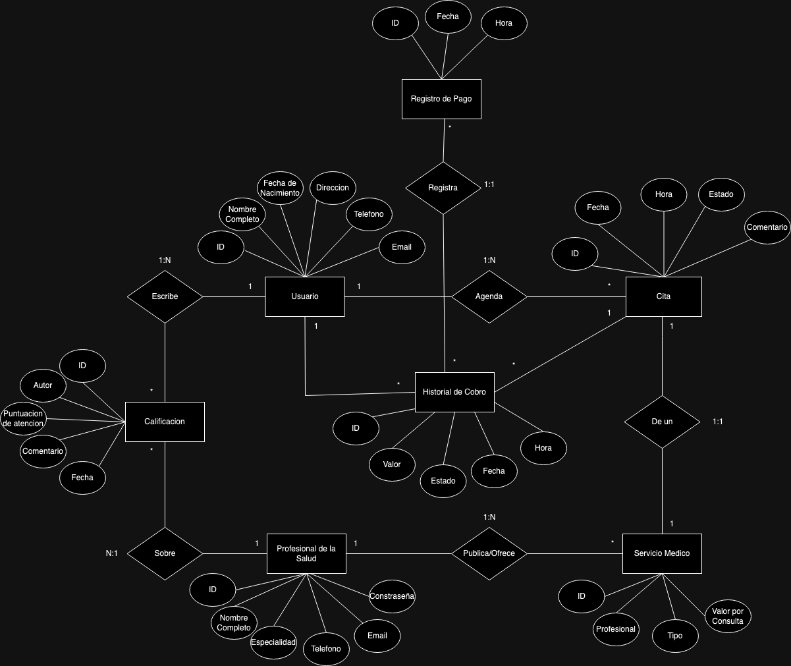

# Plataforma Médica
##### Proyecto Final de Base de Datos

- **Alumno:** Benjamin Moraga R.
- **Curso:** Base de Datos

## Introducción

En la era digital, la tecnología ha revolucionado la manera en que accedemos a los servicios de salud. La gestión eficiente de la información y la accesibilidad a la atención médica se han vuelto fundamentales para mejorar la experiencia del paciente y optimizar los recursos sanitarios. En este informe, exploraremos el desarrollo de una plataforma médica para agendar citas, con un enfoque en el modelo de negocio que permite a los médicos ofrecer sus servicios a través de la plataforma, cobrando un porcentaje de las consultas realizadas.

## Objetivo

El principal objetivo de la plataforma médica para agendar citas es facilitar a los usuarios el acceso a una amplia gama de profesionales de la salud, permitiéndoles agendar consultas de manera conveniente y eficiente. Además, se busca brindar a los médicos una plataforma donde puedan ofrecer sus servicios de manera sencilla y llegar a un mayor número de pacientes. La plataforma se diseñará con el propósito de mejorar la experiencia tanto del paciente como del médico, ofreciendo herramientas intuitivas y eficaces para la gestión de citas médicas.

## Situación problemática

La gestión tradicional de citas médicas puede ser un proceso tedioso y poco eficiente tanto para los pacientes como para los profesionales de la salud. La dificultad para encontrar horarios disponibles, la falta de coordinación entre pacientes y médicos, y los largos tiempos de espera son algunos de los desafíos comunes en este ámbito. Además, muchos médicos enfrentan dificultades para promocionar sus servicios y llegar a nuevos pacientes. Ante esta situación, se hace necesario desarrollar soluciones tecnológicas que permitan una gestión más eficiente de las citas médicas y faciliten la conexión entre pacientes y profesionales de la salud.

## Modelo de negocio

El modelo de negocio de la plataforma médica para agendar citas se basa en permitir a los médicos ofrecer sus servicios a través de la plataforma, cobrando un porcentaje de las consultas realizadas. Los médicos podrán registrarse en la plataforma y crear sus perfiles, donde podrán especificar su especialidad, disponibilidad y tarifas. Los pacientes podrán buscar y agendar citas con los médicos que mejor se ajusten a sus necesidades, y al concretarse una consulta a través de la plataforma, se cobrará un porcentaje de la tarifa acordada, como comisión por el uso de la plataforma. Este modelo de negocio permite a los médicos ampliar su base de pacientes y aumentar su visibilidad en línea, mientras que proporciona a los usuarios acceso a una amplia variedad de profesionales de la salud y una experiencia de agendamiento de citas conveniente y eficiente.

## Diagrama Entidad - Relación

## Listado de Tablas

|**Tabla**|*platform\_user*||||||
| - | - | :- | :- | :- | :- | :- |
|**Desc**|Contiene toda la información sobre el usuario||||||
|**KEY**|**COLUMN**|**TYPE**|**LENGTH**|**NOT NULL**|**UNIQUE**|**DEFAULT**|
|PK|user\_id|INT||TRUE|TRUE|AUTO\_INCREMENT|
||user\_name|VARCHAR|30|TRUE|||
||birthdate|DATE||TRUE|||
||direction|VARCHAR|20|TRUE|||
||phone|VARCHAR|10|TRUE|||
||email|VARCHAR|15|TRUE|||
||user\_password|VARCHAR|16|TRUE|||

|**Tabla**|*appointment*||||||
| - | - | :- | :- | :- | :- | :- |
|**Desc**|Contiene los datos de la cita médica, como fecha, hora, servicio, usuario…||||||
|**KEY**|**COLUMN**|**TYPE**|**LENGTH**|**NOT NULL**|**UNIQUE**|**DEFAULT**|
|PK|appointment\_id|INT||TRUE|TRUE|AUTO\_INCREMENT|
||appoint\_date|DATE||TRUE|||
||appoint\_hour|TIME||TRUE|||
||appoint\_state|INT||TRUE|||
||diagnostic\_com mentary|VARCHAR|250|TRUE|||
|FK|user\_id|INT||TRUE|||
|FK|service\_id|INT||TRUE|||

|**Tabla**|*medical\_service*||||||
| - | - | :- | :- | :- | :- | :- |
|**Desc**|Contiene los datos del servicio médico publicado por el especialista.||||||
|**KEY**|**COLUMN**|**TYPE**|**LENGTH**|**NOT NULL**|**UNIQUE**|**DEFAULT**|
|PK|service\_id|INT||TRUE|TRUE|AUTO\_INCREMENT|
||service\_descrip tion|VARCHAR|50|TRUE|||
||service\_type|INT||TRUE|||
||service\_price|DECIMAL||TRUE|||
|FK|professional\_id|INT||TRUE|||

|**Tabla**|*health\_professional*||||||
| - | - | :- | :- | :- | :- | :- |
|**Desc**|Contiene los datos del profesional de la salud registrado en la plataforma.||||||
|**KEY**|**COLUMN**|**TYPE**|**LENGTH**|**NOT NULL**|**UNIQUE**|**DEFAULT**|
|PK|professional\_id|INT||TRUE|TRUE|AUTO\_INCREMENT|
||professional\_na me|VARCHAR|50|TRUE|||
||speciality|VARCHAR|30|TRUE|||
||phone|VARCHAR||TRUE|||
||email|VARCHAR||TRUE|||
||professional\_pa ssword|VARCHAR|16|TRUE|||

|**Tabla**|*feedback*||||||
| - | - | :- | :- | :- | :- | :- |
|**Desc**|Contiene los datos de la calificación del cliente sobre algún profesional.||||||
|**KEY**|**COLUMN**|**TYPE**|**LENGTH**|**NOT NULL**|**UNIQUE**|**DEFAULT**|
|PK|feedback\_id|INT||TRUE|TRUE|AUTO\_INCREMENT|
||calification|INT||TRUE|||
||commentary|VARCHAR|250|TRUE|||
|FK|author\_id|INT||TRUE|||
|FK|professional\_id|INT||TRUE|||

|**Tabla**|*platform\_user\_bill\_history*||||||
| - | - | :- | :- | :- | :- | :- |
|**Desc**|Contiene los datos de las deudas de los usuarios que han asistido a citas médicas.||||||
|**KEY**|**COLUMN**|**TYPE**|**LENGTH**|**NOT NULL**|**UNIQUE**|**DEFAULT**|
|PK|bill\_id|INT||TRUE|TRUE|AUTO\_INCREMENT|
||bill\_value|DECIMAL||TRUE|||
||bill\_date|DATE||TRUE|||
||bill\_hour|TIME||TRUE|||
||bill\_paid|BOOLEAN||TRUE|||
|FK|user\_id|INT||TRUE|||
|FK|appointment\_id|INT||TRUE|||

|**Tabla**|*payment\_log*||||||
| - | - | :- | :- | :- | :- | :- |
|**Desc**|Contiene los registros de los pagos efectuados por los usuarios.||||||
|**KEY**|**COLUMN**|**TYPE**|**LENGTH**|**NOT NULL**|**UNIQUE**|**DEFAULT**|
|PK|log\_id|INT||TRUE|TRUE|AUTO\_INCREMENT|
||log\_date|DATE||TRUE|||
||log\_time|TIME||TRUE|||
|FK|bill\_id|INT||TRUE|||

Funcionalidades

Vistas

|Vista|health\_professional\_services\_view|
| - | - |
|Utilidad|Sirve para ver el coste de los servicios de cada médico.|

|Vista|users\_appointment\_view|
| - | - |
|Utilidad|Sirve para ver la fecha y el estado de las citas médicas de los usuarios.|

|Vista|health\_professional\_appointment\_view|
| - | - |
|Utilidad|Sirve para ver cuantas citas médicas tiene cada médico de la plataforma|

|Vista|users\_bills\_debt|
| - | - |
|Utilidad|Sirve para ver cuánto debe cada usuario.|

|Vista|feedback\_users\_view|
| - | - |
|Utilidad|Sirve para ver las calificaciones y comentarios mostrando al usuario autor y al profesional calificado|

Funciones

|Funcion|get\_user\_debt|
| - | - |
|Utilidad|Obtiene la deuda total de un usuario de la plataforma.|

|Funcion|get\_califications\_average|
| - | - |
|Utilidad|Obtiene el promedio de calificaciones sobre un médico en específico.|

Stored Procedures

|SP|get\_feedback\_order|
| - | - |
|Descripción|Obtiene una lista de un join entre feedback y health\_professional ordenada de un campo especificado en el argumento. (Puede ser ordenada tanto ascendente como descendente).|

|SP|manage\_appointments|
| - | - |
|Descripción|Sirve para agregar y eliminar citas médicas.|

Triggers

|Trigger|available\_schelude|
| - | - |
|Activación|Se activa cuando se intenta agendar cita con una fecha y hora previamente agendada con el médico.|

|Trigger|register\_bill|
| - | - |
|Activación|Se activa cada vez que una cita médica pasa a estado 2 (Completada) y genera un registro en el historial de cobros (platform\_user\_bill\_history).|

|Trigger|register\_payment|
| - | - |
|Activación|Se activa cada vez que se paga una deuda del historial de cobros, dejando un registro del pago en la tabla payment\_log.|

Herramientas Utilizadas

1. MySQL Workshop:
- **Descripción:** MySQL Workshop es una herramienta de administración de bases de datos MySQL que proporciona una interfaz gráfica intuitiva para diseñar, administrar y consultar bases de datos relacionales.
- **Uso en el proyecto:** Se utilizó para crear la base de datos que sustenta la plataforma médica, lo que incluye la definición de tablas, relaciones, índices y consultas SQL para gestionar la información de los pacientes, médicos, citas y otros aspectos relevantes del sistema.
2. Google Docs:
- **Descripción:** Google Docs es una aplicación de procesamiento de texto en línea que permite la creación y edición de documentos de manera colaborativa, con capacidad de almacenamiento en la nube.
- **Uso en el proyecto:** Se utilizó para escribir los diferentes informes relacionados con el desarrollo y la documentación del proyecto. La herramienta proporcionó un entorno familiar y accesible para registrar y organizar la información relevante, lo que facilitó la gestión y presentación de los detalles del proyecto de forma eficiente y centralizada.
3. Diagrams.net:
- **Descripción:** Diagrams.net (anteriormente conocido como draw.io) es una herramienta en línea para crear diagramas de manera fácil y rápida, incluidos diagramas de flujo, diagramas de entidad-relación, diagramas UML, entre otros.
- **Uso en el proyecto:** Se utilizó específicamente para crear el diagrama entidad-relación que visualiza la estructura de la base de datos, incluyendo las entidades, sus atributos y las relaciones entre ellas, lo que ayudó a comprender la organización de la información y facilitó el diseño y la implementación de la base de datos.
4. Chat GPT:
- **Descripción:** Chat GPT es una aplicación de inteligencia artificial que permite generar texto de manera autónoma basado en entradas de texto proporcionadas por el usuario.
- **Uso en el proyecto:** Se utilizó para crear las inserciones de datos en SQL de forma eficiente y precisa. A través de la interacción con el modelo de lenguaje, se generaron instrucciones SQL que fueron utilizadas para insertar datos en las tablas

  de la base de datos, lo que agilizó el proceso de carga de información y minimizó posibles errores humanos en la escritura manual de comandos SQL.

5. Git/GitHub:
- **Descripción:** Git es un sistema de control de versiones distribuido y GitHub es una plataforma basada en la web que utiliza Git para el alojamiento de repositorios de código.
- **Uso en el proyecto:** Se utilizó para gestionar versiones de los scripts SQL de la base de datos, asegurando la integridad y trazabilidad de los cambios realizados durante el desarrollo del proyecto. Facilitó la organización y seguridad de los scripts, permitiendo un seguimiento preciso de las modificaciones realizadas a lo largo del tiempo y proporcionando una forma eficiente de revertir cambios si fuera necesario.
12
